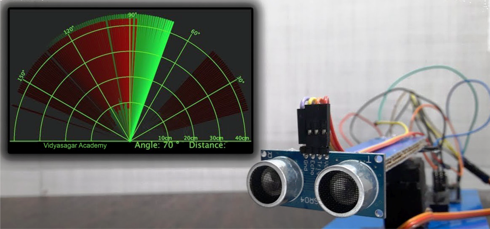

  

  
  
  
  
  

# Arduino + Processing RADAR System (v1.0)

A complete RADAR-like scanning system built using **Arduino UNO**, **HC-SR04 Ultrasonic Sensor**, **SG90 Servo Motor**, and **Processing IDE**.  
This project visually represents obstacle distance on a sweeping RADAR screen, making it ideal for beginners learning Arduino–Processing serial communication.

---

## 📂 Project Structure

arduino_radar/
└── arduino_radar.ino

arduino_radar_processing_code/
└── arduino_radar_processing_code.pde

---

## 🛠️ Hardware Requirements

- Arduino UNO (or compatible board)  
- HC-SR04 Ultrasonic Sensor  
- SG90 Servo Motor  
- Jumper Wires  
- USB Cable  
- Computer with Arduino IDE & Processing IDE installed  

---

## 🔌 Wiring Details

| Component | Arduino Pin |
|----------|-------------|
| HC-SR04 Trig | D9 |
| HC-SR04 Echo | D10 |
| Servo Signal | D3 |
| VCC | 5V |
| GND | GND |

---

## 🚀 How to Run

### **1. Arduino Side**
1. Open `arduino_radar.ino` in Arduino IDE.  
2. Select your Arduino board and COM port.  
3. Upload the code.

### **2. Processing Side**
1. Open `arduino_radar_processing_code.pde` in Processing IDE.  
2. At **Line 25**, update the serial port index to match the Arduino COM port.  
3. Run the sketch to launch the RADAR screen.

---

## 🎯 Features

- Smooth servo scanning from 0° to 180°  
- Real-time distance measurement display  
- Graphical RADAR interface in Processing  
- Object detection with dynamic coloring  
- Easy-to-understand, student-friendly codebase  

---

## 📦 Version

**Current Release:** v1.0  
This is the first stable public release, fully tested at Vidyasagar Academy.

---

## 📜 License

This project is released under the MIT License.  
See **license.txt** in this repository for details.

---

## 📘 Changelog

See **changelog.txt** for version history.

---

## ❤️ Credits

Developed at **Vidyasagar Academy**  
Website: https://www.vsa.edu.in/

For educational use by students learning Arduino, Robotics, and real-time visualization.

---
